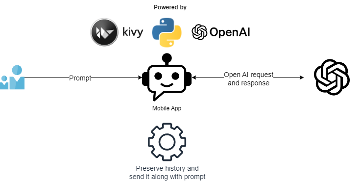

## A Chatbot project using ChatGPT/GenAI

You may hear GenAI and ChatGPT buzz from everywhere these days and the most popular message is "If you know how to use ChatGPT you can do whatever you want". 

I like an experimentation and challenges. I thought: "Why not?". I've never developed a chatbot  and never developed a mobile application.
I signed up for a double challenge.

Since you are very busy people let me just summarize key points from my experience:

+ Yes! It is actually possible to develop whatever you want using ChatGPT!
+ ChatGPT can give a real boost in productivity and significantly decrease a prototype delivery time
+ The code generation may take 5-10% of all time spent for development. The picture below is a true representation.

+ If you use GitHub for code management, you need to apply techiniques to hide your OpenAI API key. It can be accidentally leaked to the GutHub public repo and seen by other people. Luckly, OpenAI developed Internet scan to detect such leak and block the leaked API key. My leaked key was detected within 10 minutes.
+ The Chat GPT 3.5 is trained on historical data and may not be aware about recent changes in the libraries. For example, it was not able to suggest me the correct syntax for OpenAI API response method. Thus, old school googling skills are still useful. Another option is probably to use GPT-4, but it is still a paid option as of now.

The overall architechture was very simple. See a diagram below.

Here is an example of mobile application window with a sample question and the response recived from OpenAI.

Voilà! A simple GenAI application is developed!

P.S.: To publish a mobile app to Google store you need to sign up for a  Google Play Developer account which may cost you about $25CAD. I don't have an appetite to do that right now, but may try later.
